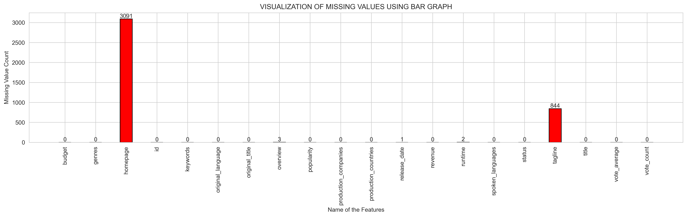
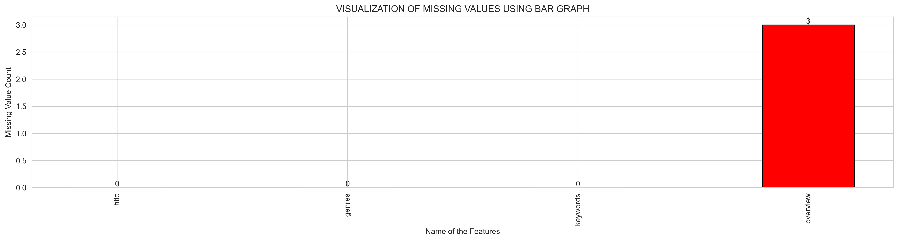
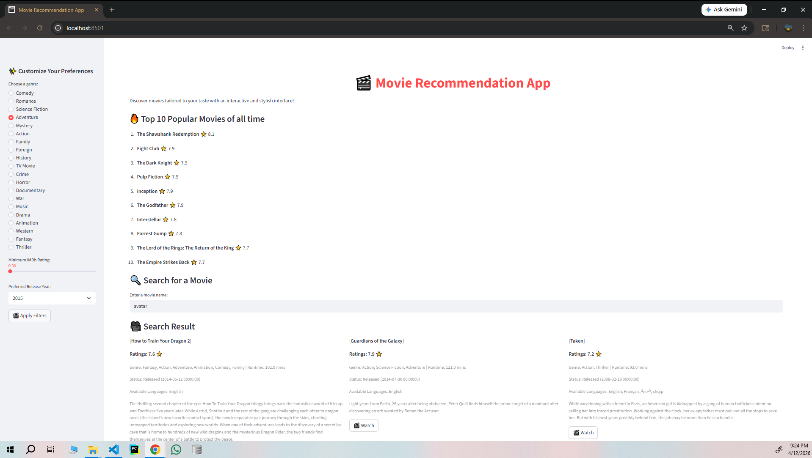
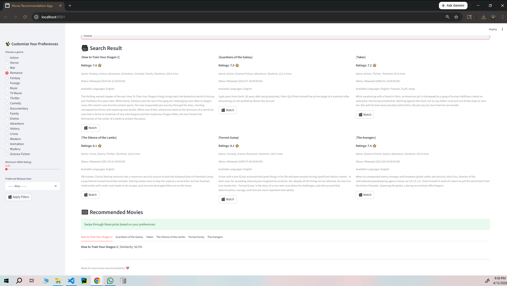

# 🎬 Movie Recommendation System

<div align="center">


**A content-based movie recommendation engine powered by NLP and cosine similarity, served through an interactive Streamlit web application.**

[Features](#-features) · [Architecture](#-architecture) · [Dataset](#-dataset) · [Modeling](#-modeling) · [Results](#-results--key-insights) · [Getting Started](#-getting-started) · [App Demo](#-app-demo)

</div>

---

## 📌 Project Overview

This project builds an end-to-end **content-based filtering recommendation system** that suggests movies similar to a user's input. The system processes raw movie metadata — genres, keywords, and plot overviews — transforms it into rich semantic feature vectors using NLP techniques, and computes pairwise similarity across **4,803 movies** using cosine similarity.

The final model is deployed as an interactive **Streamlit web app** with real-time search, genre/rating/year filters, and a top-10 popularity ranking powered by the IMDB weighted rating formula.

---

## ✨ Features

| Feature | Description |
|---|---|
| 🔍 **Semantic Search** | Find movies by title and get content-similar recommendations |
| 📊 **Popularity Ranking** | Top-10 movies ranked by IMDB-style weighted rating formula |
| 🎭 **Genre Filtering** | Filter by 20+ genres extracted from structured metadata |
| ⭐ **Rating Filter** | Minimum IMDb rating threshold via sidebar slider |
| 📅 **Year Filter** | Browse movies by release year |
| 🗂️ **Tabbed Results** | Carousel-style recommendation tabs with similarity scores |

---

## 🏗️ Architecture

```
movie_recommendation-system/
│
├── app/                          # Streamlit web application
│   ├── app.py                    # Main app UI (search, filters, results)
│   ├── backend.py                # Recommendation logic & popularity scoring
│   └── config_loader.py          # YAML config loader
│
├── src/
│   ├── features/
│   │   ├── load_data.py          # Data loading utilities
│   │   ├── preprocess.py         # Data cleaning & preprocessing
│   │   └── build_features.py     # NLP feature engineering pipeline
│   ├── model_training/
│   │   └── training_pipeline.py  # End-to-end training pipeline
│   ├── movie_recommendation/
│   │   └── recommend.py          # Standalone recommendation module
│   └── utils/
│       └── helper.py             # Object serialization helpers
│
├── notebooks/
│   ├── 01_data_overview.ipynb
│   ├── 02_eda_movies.ipynb
│   ├── 03_feature_engineering.ipynb
│   ├── 04_popular_rated_movies.ipynb
│   ├── 05_model_training_intuition.ipynb
│   └── reports/                  # EDA visualizations
│
├── data/
│   ├── raw/                      # Source CSVs (movies, credits, ratings)
│   ├── cleaned/                  # Processed movie_data_cleaned.csv
│   └── train/                    # meta_data.csv for model training
│
├── artifacts/
│   └── cosine_model.pkl          # Serialized cosine similarity matrix
│
└── requirements.txt
```

---

## 📂 Dataset

The dataset is sourced from a **TMDB-style movie metadata corpus** comprising three interconnected files:

| File | Records | Description |
|---|---|---|
| `movies.csv` | 4,803 | Full movie metadata (budget, genres, keywords, overview, ratings) |
| `credits.csv` | 4,803 | Cast and crew JSON attributes |
| `ratings.csv` | 100,004 | User–movie interaction and rating data |
| `movies_small.csv` | 6 | Reduced sample subset for testing |

**Key columns used for content-based filtering:**
- `genres` — JSON list of genre objects
- `keywords` — JSON list of thematic keywords
- `overview` — Free-text plot synopsis
- `vote_average`, `vote_count` — Rating signals for popularity ranking

---

## 🔬 Exploratory Data Analysis

### Missing Value Analysis

Missing data was identified early in the pipeline and handled with targeted imputation strategies.

**All Features — Missing Value Heatmap:**



**Required Features — Missing Value Heatmap:**



### EDA Conclusions

> **Finding 1 — Missing Overview:** The `overview` column contains missing values in a small subset of records. These were imputed with empty strings to preserve dataset size without introducing noise.

> **Finding 2 — Genre & Keyword Structure:** `genres` and `keywords` are stored as serialized JSON lists. They required parsing and flattening before being usable as text features.

> **Finding 3 — No Duplicate Records:** No duplicate movie records were found after deduplication checks, confirming dataset integrity.

> **Finding 4 — Class Imbalance in Genres:** Drama and Comedy are the most represented genres while niche categories like TV Movie and Foreign have very sparse representation.

---

## ⚙️ Feature Engineering Pipeline

The feature engineering pipeline transforms raw text fields into a consolidated **`meta_tags`** column used for vectorization:

```
genres (JSON)  ──┐
keywords (JSON) ─┤──► Parse & Flatten ──► Text Cleaning ──► RAKE Keyword Extraction ──► Lemmatization ──► meta_tags
overview (text) ─┘
```

### Step-by-Step Process

1. **JSON Parsing** — `genres` and `keywords` fields are parsed from serialized JSON and their `name` values are extracted.
2. **Text Cleaning** — Lowercasing, special character removal using regex `[^a-z0-9 ]+`.
3. **RAKE Keyword Extraction** — Rapid Automatic Keyword Extraction (RAKE) is applied to plot overviews to surface the most discriminative phrases.
4. **Lemmatization** — NLTK's `WordNetLemmatizer` is used instead of stemming to preserve semantic meaning (e.g., *running* → *run*, not *runn*).
5. **Feature Concatenation** — `genres_clean + keywords_clean + overview_keywords` → `meta_tags`.

> **Why Lemmatization over Stemming?**  
> Meta tags are semantically sensitive. Stemming aggressively clips word suffixes, potentially altering meaning. Lemmatization produces dictionary-valid root forms, preserving the intent of genre and keyword descriptors.

---

## 🤖 Modeling

### Algorithms Evaluated

Two method combinations were explored and benchmarked:

| Method | Vectorizer | Similarity | L2 Regularization | Speed |
|---|---|---|---|---|
| **Method 1** | TF-IDF Vectorizer | Linear Kernel | ✅ Built-in (TF-IDF) | ⚡ Faster |
| **Method 2** | Count Vectorizer | Cosine Similarity | ✅ Built-in (Cosine) | 🐢 Slower |

### Model Design Rationale

**Method 1 — TF-IDF + Linear Kernel:**
- Linear Kernel computes dot-product similarity without L2 normalization.
- TF-IDF compensates by downweighting common terms and normalizing vectors (L2 norm), making the pairing mathematically sound.
- Preferred for speed-sensitive scenarios with large feature spaces.

**Method 2 — Count Vectorizer + Cosine Similarity:**
- Count Vectorizer produces raw term frequency vectors without normalization.
- Cosine Similarity inherently applies L2 normalization during computation (angle between vectors), compensating for the absence of IDF weighting.
- Produces qualitatively richer recommendations due to equal weight given to all term occurrences.

### ✅ Final Model Selection: Count Vectorizer + Cosine Similarity

> **Cosine Similarity returned more contextually relevant and diverse recommendations** in side-by-side evaluations for the same query movies (e.g., *John Carter*, *Avatar*). The Count Vectorizer's equal treatment of all genre and keyword tokens proved more effective for this content-based domain compared to the IDF dampening applied by TF-IDF.

---

## 📊 Model Comparison

### Head-to-Head Evaluation (Input: *"John Carter"*)

| Rank | Linear Kernel (TF-IDF) | Cosine Similarity (Count) |
|---|---|---|
| 1 | Titan A.E. | Titan A.E. |
| 2 | Treasure Planet | Guardians of the Galaxy |
| 3 | Mars Needs Moms | The Fifth Element |
| 4 | The Black Hole | Prometheus |
| 5 | Jason and the Argonauts | Outlander |

> **Observation:** Cosine Similarity with Count Vectorizer surfaces higher-profile, thematically richer films (e.g., *Guardians of the Galaxy*, *Prometheus*) while Linear Kernel tends toward obscure titles with exact keyword overlap.

### Performance Characteristics

| Metric | TF-IDF + Linear Kernel | Count Vectorizer + Cosine |
|---|---|---|
| Matrix Computation Time | Faster | Slower |
| Vocabulary Size Handling | Better (IDF dampens noise) | Equal weight to all terms |
| Recommendation Diversity | Lower | Higher |
| Sensitivity to Common Terms | Lower (IDF penalizes) | Higher |
| **Final Verdict** | ❌ Not Selected | ✅ **Selected** |

---

## 🏆 Popularity Ranking — IMDB Weighted Rating Formula

The app's **Top 10 Popular Movies** section uses the IMDB Bayesian weighted rating formula to score movies fairly regardless of vote count:

```
Weighted Rating (WR) = (v / (v + m)) × R + (m / (v + m)) × C
```

Where:
- `v` = Number of votes for the movie
- `m` = Minimum votes required (90th percentile of vote counts)
- `R` = Average rating of the movie
- `C` = Mean rating across the entire dataset

> This formula prevents movies with few but perfect ratings from dominating, while ensuring genuinely popular titles with high vote counts rank at the top.

---

## 💡 Key Insights

1. **Content-based filtering excels at cold-start** — No user history is needed. Any movie title is enough to generate recommendations.

2. **NLP preprocessing quality directly impacts similarity quality** — RAKE extraction + lemmatization over raw overview text significantly improved the relevance of recommendations compared to naively vectorizing the full plot text.

3. **Cosine similarity is the right metric for text similarity** — Its angle-based measure is scale-invariant, making it robust to varying document lengths (short vs. long plot descriptions).

4. **Feature fusion is critical** — Combining genres, keywords, and overview into a single `meta_tags` field creates a richer feature space than any single field alone.

5. **Weighted rating vs. raw rating** — Using a raw `vote_average` for popularity would surface low-vote niche films unfairly. The Bayesian weighted rating aligns closer to real-world popularity expectations.

6. **Scalability trade-off** — The cosine similarity matrix is precomputed and stored as a `.pkl` artifact (≈185MB for 4,803 movies). At larger scales (100k+ movies), approximate nearest-neighbor methods (e.g., FAISS, Annoy) would be necessary.

---

## 🚀 Getting Started

### Prerequisites

- Python 3.11+
- pip

### Installation

```bash
# Clone the repository
git clone https://github.com/<your-username>/movie-recommendation-system.git
cd movie-recommendation-system

# Install dependencies
pip install -r requirements.txt

# Download NLTK data
python -c "import nltk; nltk.download('wordnet'); nltk.download('stopwords'); nltk.download('punkt')"
```

### Train the Model

```bash
cd src/model_training
python training_pipeline.py
```

This will preprocess the data, build feature vectors, compute the cosine similarity matrix, and serialize it to `artifacts/cosine_model.pkl`.

### Run the App

```bash
cd app
streamlit run app.py
```

The app will open in your browser at `http://localhost:8501`.

---

## 🖥️ App Demo

The Streamlit app provides three core experiences:

**1. Top 10 Popular Movies** — Ranked by IMDB weighted rating formula on load.

**2. Search & Recommend** — Enter any movie title to get 6 content-similar recommendations displayed in a 3-column grid with genre, runtime, release date, and language info.

**3. Tabbed Similarity View** — Each recommended movie opens in a dedicated tab with its similarity score percentage.

**Sidebar Controls:**
- Genre radio selector (20+ genres)
- Minimum IMDb rating slider (0–10)
- Release year dropdown (Any → specific year)




---

## 🛠️ Tech Stack

| Layer | Technology |
|---|---|
| Language | Python 3.11 |
| Web App | Streamlit |
| NLP | NLTK, RAKE-NLTK |
| Vectorization | scikit-learn (TF-IDF, CountVectorizer) |
| Similarity | scikit-learn (cosine_similarity, linear_kernel) |
| Data | Pandas, NumPy |
| Serialization | Pickle |
| Config | PyYAML |
| Environment | python-dotenv |

---

## 📈 Future Improvements

- [ ] **Hybrid Filtering** — Combine content-based with collaborative filtering (SVD/ALS on `ratings.csv`) for personalized recommendations
- [ ] **FAISS Integration** — Replace precomputed matrix with approximate nearest-neighbor search for scalability to 100k+ movies
- [ ] **Transformer Embeddings** — Replace Bag-of-Words with sentence-transformers (`all-MiniLM-L6-v2`) for deeper semantic similarity
- [ ] **Movie Poster Integration** — Fetch posters via TMDB API to enrich the app UI
- [ ] **User Sessions** — Add watch history and preference memory via session state

---

## 📄 License

This project is licensed under the MIT License. See `LICENSE` for details.

---

<div align="center">
Made with ❤️ | Built for learning and portfolio purposes
</div>
